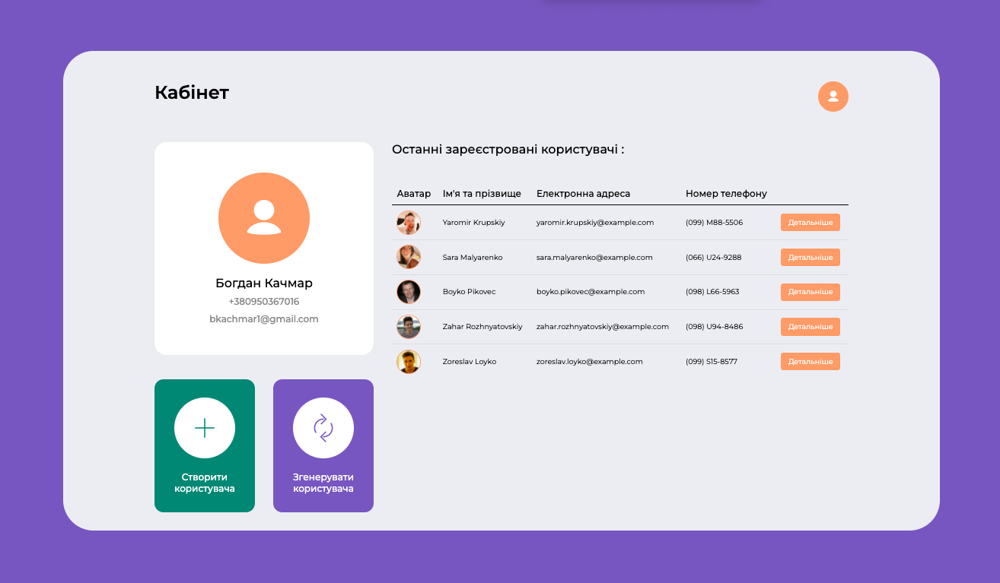

# UserCreator

## Links
<b>Figma: </b><a href="https://www.figma.com/file/kuNPvVjHTC2pPEIMyj5AhS/Untitled?node-id=0%3A1&t=2y87PKHhehgEambd-1">userCreator</a>
 
<b>Website: </b><a href="https://user-creator-mu.vercel.app">userCreator</a>

## Web technologies
- html
- css
- jquery

## Libraries
- bootstrap 3

## Description
Figma was used to create the design, and HTML, CSS, jQuery and Bootstrap 3 were used to implement the functionality.